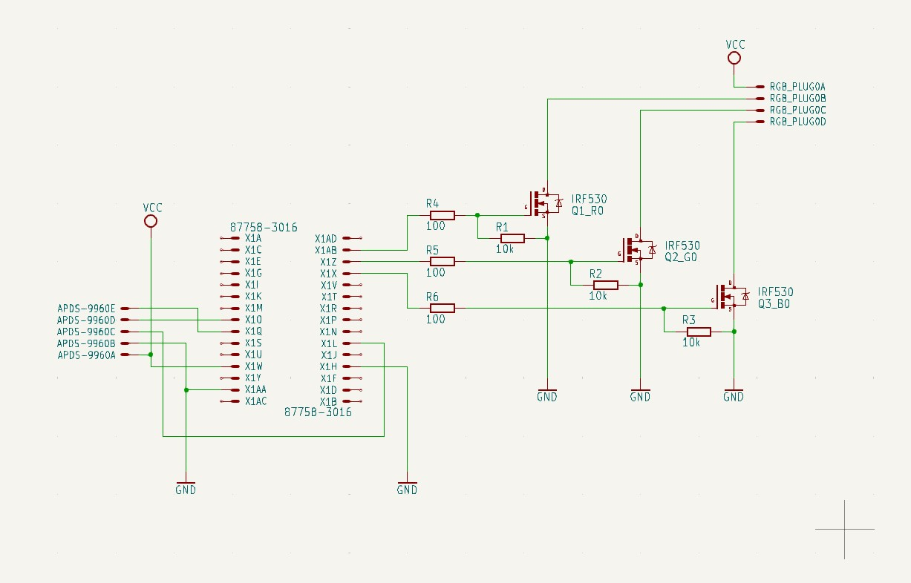

# led-sync
Code for arduino to control bias lightning.
Orignally written for Arduino Nano. Pinout has to be adjusted to other PCBs pinout.

# Pinout
 * 3  - Interrupt pin for Gesture Sensor
 * 9  - PWM Red color
 * 10 - PWM Green color
 * 11 - PWM Blue color
 * 18 - SDA pin for Gesture Sensor
 * 19 - SCL pin for Gesture Sensor
 * 5V (pin 27) wire to Gesture Sensor & to Power Supply
 * GND wire to Gesture Sensor & Power Supply

 # Wiring

 

# Serial Comands
Send single string command on COM port.

## Set Mode
Example command:\
```SERIAL```

* SOLID - constant light (no blink)
* ALIVE - breath effect (slowly lighten and darken light)
* DISCO - change color over time.

## Set Color
You can define color by sending SET command:\
```SET=XXX,YYY,ZZZ```

Color is specified in HSV:
HUE=XXX
SAT=YYY
VALUE=ZZZ

Remember to always send value in three digit format (for example send 015 instead of 15).

# Gesture Sensor
In this project I used gesture sensor APDS9960. 

* DOWN - Turn on light. Switch between Solid and breath mode.
* UP - Turn off light
* LEFT / RIGHT - Switch color (16 defined colors).

# DOC
* Sparkfun sensor doc https://github.com/sparkfun/SparkFun_APDS-9960_Sensor_Arduino_Library
* HSV_to_RGB conversion https://gist.github.com/hdznrrd/656996.js"